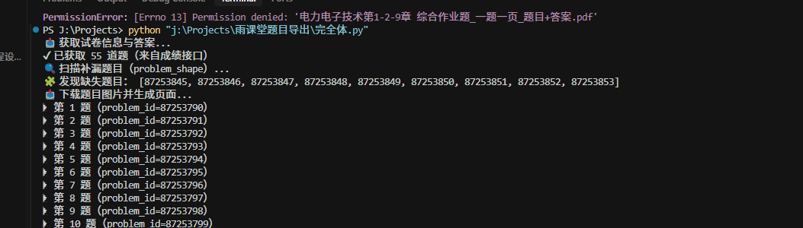

<h1 align="center">📘 雨课堂试题导出工具</h1>
<h1 align="center"
    style="
        color: white;
        background: linear-gradient(90deg, red, orange);
        padding: 14px;
        border-radius: 10px;
        font-size: 30px;
        font-weight: bold;
    ">
操蛋了，我研究了半天好不容易弄好才发现原来它本身就再带导出试卷的功能
</h1>

  使用 Python 自动导出雨课堂试题为 PDF（支持一题一页 + 正确答案）

<h2>✨ 功能特点</h2>
<ul>
  <li>✅ 自动抓取试题内容（图片渲染题也支持）</li>
  <li>✅ 自动获取正确答案（客观题）</li>
  <li>✅ 一题一页导出 PDF</li>
  <li>✅ 自动补全选项 A / B / C / D</li>
  <li>✅ 自动排版，便于打印和查看</li>
</ul>

<h2>📸 效果展示</h2>

  

<h2>🛠 使用步骤</h2>

<h3>① 获取 Cookie</h3>
<ol>
  <li>打开雨课堂试卷页面</li>
  <li>按 <code>F12</code> 打开开发者工具</li>
  <li>切换到 <b>Console（控制台）</b></li>
  <li>输入下面代码并回车：</li>
</ol>

<pre><code>document.cookie
</code></pre>

<ol start="5">
  <li>他会复制一整串 cookie</li>
</ol>

<h3>② 修改代码</h3>

打开 <code>main.py</code>，修改下面两行：

<pre><code>PAGE_URL = "你的测验链接"
cookie_str = "你的cookie"
</code></pre>

示例：

<pre><code>PAGE_URL = "https://www.yuketang.cn/v2/web/studentQuiz/xxxx"
cookie_str = "csrftoken=xxx; sessionid=xxx; classroomId=xxx; classroom_id=xxx"
</code></pre>

<h3>③ 运行脚本</h3>

<pre><code>pip install requests Pillow
python main.py
</code></pre>

<h3>④ 输出结果</h3>

程序会在当前目录生成 PDF 文件，例如：

<pre><code>xxx_一题一页_题目+答案.pdf
</code></pre>

<h2>⚠️ 注意事项</h2>
<ul>
  <li>❗ Cookie 有时效，失效后需要重新获取</li>
  <li>❗ 请确保在 <b>登录状态</b> 下获取 Cookie</li>
  <li>❗ 请勿上传或公开自己的真实 Cookie</li>
  <li>❗ 本项目仅供学习交流使用</li>
</ul>

<h2>🧠 实现原理</h2>
<ul>
  <li>调用雨课堂接口获取题目结构（<code>problem_shape</code>）</li>
  <li>调用结果接口获取正确答案（<code>personal_result</code>）</li>
  <li>下载题目图片并使用 Pillow 进行拼接</li>
  <li>最终导出为 PDF 文件</li>
</ul>

<h2>📦 依赖</h2>

<pre><code>requests
Pillow
</code></pre>

<h2>⭐ 支持项目</h2>

如果这个项目对你有帮助，欢迎点一个 Star。

